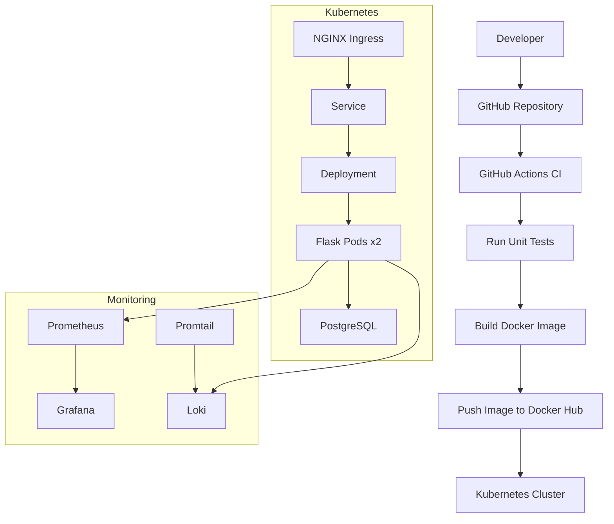
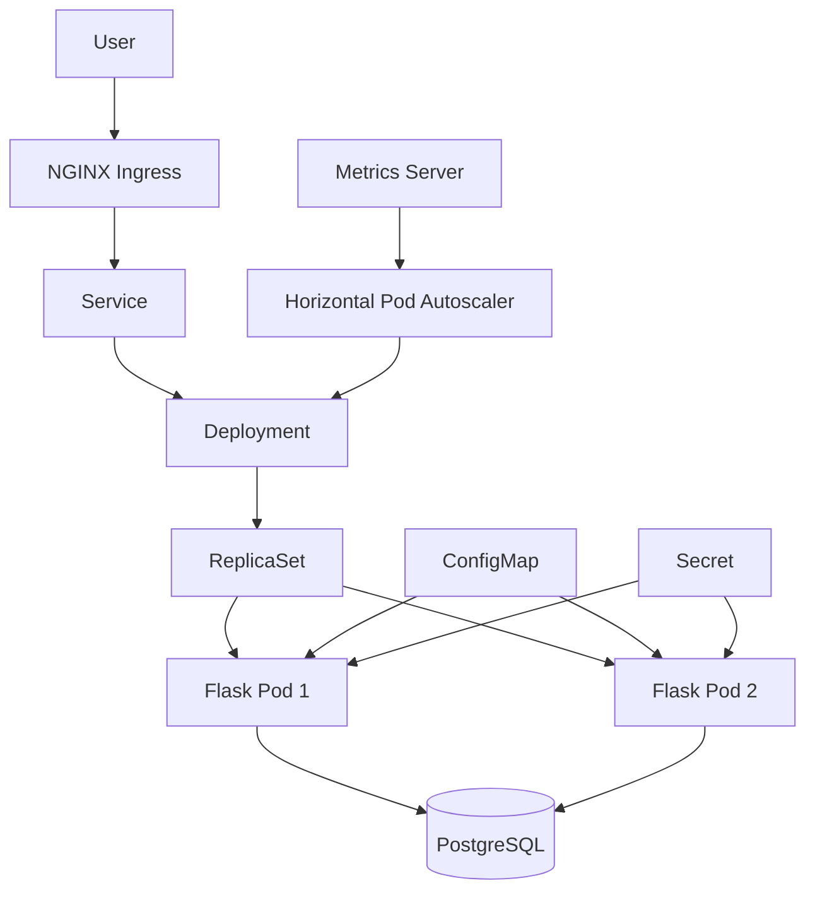
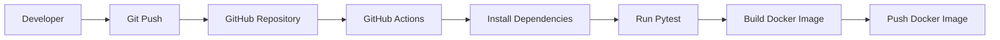
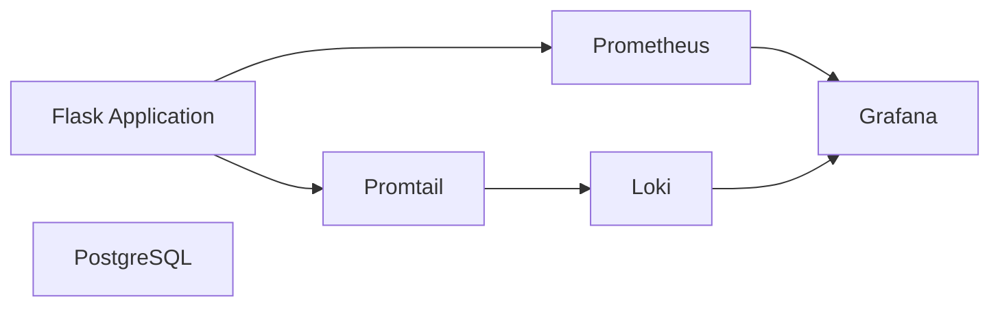

# 🚀 Ops-Pilot

> An end-to-end cloud-native DevOps platform demonstrating modern backend development, containerization, CI/CD, infrastructure automation, Kubernetes orchestration, monitoring, and logging.

---

## 📌 Overview

Ops-Pilot started as a simple Flask REST API with a PostgreSQL database and gradually evolved into a production-style DevOps platform.

The project demonstrates how a backend application moves through the complete DevOps lifecycle—from development and testing to containerization, infrastructure provisioning, Kubernetes deployment, observability, and cloud readiness.

The long-term vision is to extend the platform into an **AI Operations Copilot** capable of assisting with deployments, monitoring, troubleshooting, and operational automation.

---

## ✨ Features

- RESTful Flask Backend
- PostgreSQL Database
- Complete CRUD APIs
- Docker & Docker Compose
- GitHub Actions CI
- Kubernetes Deployment
- ConfigMaps & Secrets
- NGINX Ingress
- Horizontal Pod Autoscaler
- Terraform Infrastructure
- AWS Deployment
- Prometheus Monitoring
- Grafana Dashboards
- Loki Log Aggregation
- Promtail Log Collection
- Production-style Project Structure

---

## 🏗️ Architecture

> Overall Architecture

## 🏗️ Overall Architecture



---

> Kubernetes Architecture

## ☸️ Kubernetes Architecture



---

> CI/CD Pipeline

## 🚀 CI/CD Pipeline


---

> Monitoring Architecture

## 📈 Monitoring Architecture


---

# 🛠️ Tech Stack

| Category | Technologies |
|-----------|--------------|
| Backend | Flask, Python |
| Database | PostgreSQL |
| Containerization | Docker, Docker Compose |
| CI/CD | GitHub Actions |
| Orchestration | Kubernetes |
| Infrastructure | Terraform, AWS |
| Monitoring | Prometheus, Grafana |
| Logging | Loki, Promtail |
| Version Control | Git, GitHub |

---

# 📂 Project Structure

```text
ops-pilot/
│
├── app/
│   ├── src/
│   ├── tests/
│   ├── Dockerfile
│   └── requirements.txt
│
├── database/
│
├── k8s/
│
├── monitoring/
│
├── terraform/
|---terraform-aws
│
├── docs/
│   ├── diagrams/
│   └── screenshots/
│
├── .github/
│   └── workflows/
│
├── docker-compose.yml
├── .env.example
└── README.md
```

---

# 🌐 REST APIs

| Method | Endpoint | Description |
|----------|----------|-------------|
| GET | `/health` | Health Check |
| POST | `/users` | Create User |
| GET | `/users` | Get All Users |
| GET | `/users/{id}` | Get User By ID |
| PUT | `/users/{id}` | Update User |
| DELETE | `/users/{id}` | Delete User |

---

# ☸️ Kubernetes Features

- Deployment
- Service
- ConfigMap
- Secret
- Horizontal Pod Autoscaler
- NGINX Ingress
- Kustomize
- Resource Limits
- Liveness Probe
- Readiness Probe

---

# 📊 Monitoring Stack

- Prometheus
- Grafana
- Loki
- Promtail

The monitoring stack provides metrics, dashboards, centralized log aggregation, and application observability.

---

# 🚀 CI/CD

GitHub Actions pipeline performs:

- Dependency Installation
- Unit Testing
- Docker Image Build

The workflow demonstrates automated validation before deployment.

---

# 🏗️ Infrastructure

Infrastructure provisioning is managed using Terraform.

Current infrastructure includes:

- AWS Provider Configuration
- Variables
- Modular Infrastructure
- Infrastructure as Code

---

# 📸 Screenshots

Screenshots are available under:

```text
docs/screenshots/
```

They include:

- Flask APIs
- Docker
- Docker Compose
- GitHub Actions
- Terraform
- AWS
- Kubernetes
- Monitoring
- Grafana Dashboards

---

# 🚀 Getting Started

Clone the repository

```bash
git clone https://github.com/yourusername/ops-pilot.git
```

Install dependencies

```bash
pip install -r app/requirements.txt
```

Start Docker Compose

```bash
docker compose up -d
```

Run the application

```bash
cd app/src
python main.py
```

Access the API

```
http://localhost:5001/health
```

---

# 🗺️ Roadmap

Completed

- Flask Backend
- PostgreSQL
- CRUD APIs
- Docker
- Docker Compose
- GitHub Actions
- Terraform
- AWS
- Kubernetes
- Monitoring
- Logging

Upcoming

- AI Operations Copilot
- AI-assisted Deployment Analysis
- Intelligent Log Analysis
- AI Infrastructure Assistant
- Kubernetes Troubleshooting Assistant

---

# 👨‍💻 Author

**Sarthak Rajput**

DevOps | Cloud | Automation

---

## ⭐ If you found this project useful, consider giving it a star.