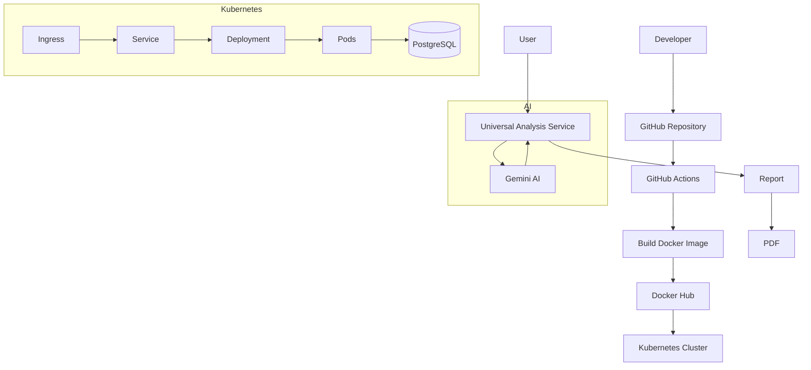

# 🚀 Ops-Pilot AI

> **AI-Powered DevOps Copilot** for Kubernetes, Docker, Terraform and Cloud Infrastructure.

Ops-Pilot AI is an end-to-end DevOps platform that combines traditional DevOps tooling with Generative AI to analyze infrastructure files, detect production issues, generate intelligent recommendations, and create professional PDF reports.

It demonstrates a complete production-grade DevOps workflow including Docker, Kubernetes, Terraform, AWS, Monitoring, Logging, CI/CD, and AI-powered infrastructure analysis.

---

# ✨ Features

## 🤖 AI Features

## 🤖 AI Features

- AI-powered Kubernetes Manifest Analysis
- AI-powered Dockerfile Analysis
- AI-powered Terraform Configuration Analysis
- Automatic Infrastructure Type Detection
- Production Readiness Score
- Overall Deployment Grade
- Infrastructure Risk Assessment
- AI-generated Deployment Summary
- Production Findings Table
- Intelligent Recommendations
- Professional PDF Report Generation

---

## ⚙️ DevOps Features

- FastAPI Backend
- Docker & Docker Compose
- Kubernetes Deployments
- ConfigMaps & Secrets
- Liveness / Readiness / Startup Probes
- Horizontal Pod Autoscaler
- NGINX Ingress
- Terraform Infrastructure
- AWS Infrastructure
- GitHub Actions CI
- Prometheus Monitoring
- Grafana Dashboards
- Loki Log Aggregation
- Promtail Log Collection

---

# 🏗️ System Architecture


```mermaid
flowchart TD

A[Developer]
--> B[GitHub Repository]

B --> C[GitHub Actions]

C --> D[Build Docker Image]

D --> E[Docker Hub]

E --> F[Kubernetes Cluster]

subgraph Kubernetes

G[Ingress]

H[Service]

I[Deployment]

J[Pods]

K[(PostgreSQL)]

end

G --> H

H --> I

I --> J

J --> K

subgraph AI

L[Universal Analysis Service]

M[Gemini AI]

end

User --> L

L --> M

M --> L

L --> Report

Report --> PDF
```

---

# 🤖 AI Analysis Workflow

```text
(Kubernetes • Dockerfile • Terraform)
            │
            ▼
Universal Analysis Service
            │
            ▼
Automatic File Detection
            │
            ▼
Gemini AI
            │
            ▼
Production Readiness Analysis
            │
            ▼
HTML Report
            │
            ▼
Professional PDF Report
```

---

# 📊 Sample Report

| Metric | Value |
|---------|------:|
| Production Score | 65/100 |
| Overall Grade | C |
| Risk Level | MEDIUM |
| Critical Issues | 0 |
| High Issues | 1 |
| Medium Issues | 1 |
| Low Issues | 1 |

---

# 📸 Screenshots

Screenshots are available under:

```text
docs/screenshots/
```

They include:

- Flask APIs
- Docker
- Docker Compose
- GitHub Actions
- Terraform
- AWS
- Kubernetes
- Monitoring
- Grafana Dashboards

---
## Dashboard

> Add screenshot here

```
docs/screenshots/dashboard.png
```

---

# 🚀 AI Capabilities

Ops-Pilot AI can currently analyze:

- ✅ Kubernetes Deployment YAML
- ✅ Dockerfile
- ✅ Terraform Configuration

The AI engine automatically detects the uploaded file type and performs production-grade validation.

Current validation includes:

- Mutable image tags
- Missing security context
- Missing startup probes
- Resource configuration
- Terraform best practices
- Dockerfile best practices
- Production readiness
- Risk assessment

---

# 🌐 API Endpoints

| Method | Endpoint | Description |
|----------|-----------|-------------|
| POST | `/analyze` | Analyze Infrastructure File |
| POST | `/download-report` | Download PDF Report |
| GET | `/health` | Health Check |

---

# 🛠️ Tech Stack

| Category | Technologies |
|-----------|--------------|
| Backend | FastAPI, Python |
| AI | Google Gemini |
| Templates | Jinja2 |
| PDF | ReportLab |
| Containerization | Docker, Docker Compose |
| Orchestration | Kubernetes |
| Infrastructure | Terraform |
| Cloud | AWS |
| CI/CD | GitHub Actions |
| Monitoring | Prometheus |
| Dashboard | Grafana |
| Logging | Loki, Promtail |
| Version Control | Git & GitHub |

---

# 📂 Project Structure

```text
ops-pilot/

├── ai-service/
│   ├── app/
│   │   ├── api/
│   │   ├── agents/
│   │   ├── services/
│   │   ├── prompts/
│   │   ├── templates/
│   │   ├── static/
│   │   ├── utils/
│   │   ├── models/
│   │   └── main.py
│   │
│   ├── requirements.txt
│   └── Dockerfile
│
├── app/
├── database/
├── docs/
├── k8s/
├── monitoring/
├── terraform/
├── terraform-aws/
├── .github/
│   └── workflows/
│
├── docker-compose.yml
├── README.md
└── LICENSE
```

---

# ☸ Kubernetes Features

- Deployment
- Service
- ConfigMap
- Secret
- Resource Requests & Limits
- Liveness Probe
- Readiness Probe
- Startup Probe
- Horizontal Pod Autoscaler
- Rolling Updates
- NGINX Ingress

---

# 📈 Monitoring Stack

The monitoring stack includes:

- Prometheus
- Grafana
- Loki
- Promtail

This provides:

- Metrics Collection
- Dashboard Visualization
- Centralized Logging
- Application Observability

---

# 🚀 CI/CD

GitHub Actions pipeline performs:

- Install Dependencies
- Run Tests
- Build Docker Image
- Validate Build

Future:

- Push Docker Image
- Kubernetes Deployment
- AI Validation Gate

---

# 🏗️ Infrastructure

Infrastructure provisioning is managed using Terraform.

Current support:

- AWS
- Infrastructure as Code
- Variables
- Modular Configuration

---

# 🚀 Getting Started

Clone the repository

```bash
git clone https://github.com/sarthakrajput17/ops-pilot.git
```

Go into the project

```bash
cd ops-pilot
```

Create a virtual environment

```bash
python -m venv venv
```

Activate

Linux / macOS

```bash
source venv/bin/activate
```

Windows

```bash
venv\Scripts\activate
```

Install dependencies

```bash
pip install -r ai-service/requirements.txt
```

Run FastAPI

```bash
cd ai-service
uvicorn app.main:app --reload
```

Open

```
http://127.0.0.1:8000
```

---

# 🗺️ Roadmap

## ✅ Completed

- FastAPI Backend
- Docker
- Docker Compose
- GitHub Actions
- Kubernetes
- Terraform
- AWS Infrastructure
- Prometheus
- Grafana
- Loki
- AI Kubernetes Analysis
- Production Readiness Scoring
- PDF Report Generation
- Dockerfile Analysis
- Terraform Analysis

---

## 🚧 Upcoming

- Docker Compose Analysis
- Helm Chart Analysis
- GitHub Actions Workflow Analysis
- AI Deployment Execution
- Kubernetes Auto Deployment
- AI Infrastructure Generation
- AI Log Analysis
- Multi-cloud Support
- Azure Support
- GCP Support

---

# 👨‍💻 Author

**Sarthak Rajput**

DevOps • Cloud • Kubernetes • AI • Automation

GitHub: https://github.com/sarthakrajput17
LinkedIn: https://www.linkedin.com/in/sarthak-rajput-0135971b5/


---

# ⭐ Support

If you found this project useful, consider giving it a ⭐ on GitHub.

It helps others discover the project and motivates future development.