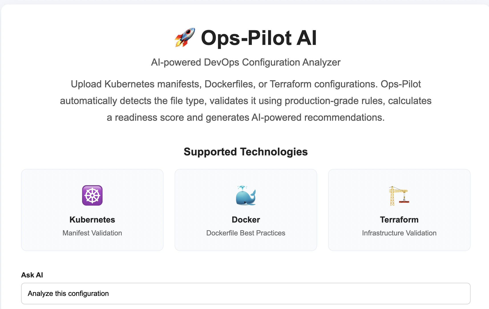

# Ops-Pilot AI

An AI-assisted DevOps project for analyzing infrastructure
configurations and practicing application delivery with Docker,
Kubernetes, GitHub Actions, and Argo CD.

Ops-Pilot has two main application components:

-   **Flask API (`app/`)**: a PostgreSQL-backed application with user
    CRUD endpoints, health checks, and Prometheus metrics.
-   **AI service (`ai-service/`)**: a FastAPI service that analyzes
    Kubernetes manifests, Dockerfiles, and Terraform files. It combines
    rule-based checks with Google Gemini explanations and can generate
    PDF reports.

This repository is a hands-on project and development environment. Some
components have been tested locally; it is not intended to represent a
fully production-hardened platform.

## Features

### Infrastructure analysis

-   Detects whether an uploaded file is a Kubernetes manifest,
    Dockerfile, or Terraform configuration.
-   Runs deterministic checks for selected configuration issues.
-   Uses Google Gemini to provide explanations and recommendations when
    configured.
-   Produces findings, a readiness score, and a downloadable PDF report.

The score is a project-specific indicator, not a formal security audit
or guarantee of production readiness.

### Application and delivery

-   Flask API with PostgreSQL.
-   Dockerfiles and Docker Compose configuration.
-   Kubernetes manifests managed with Kustomize.
-   ConfigMaps, Secrets, probes, resource requests and limits, and an
    HPA.
-   GitHub Actions for testing and Docker image publishing.
-   An automated pull request to update the Kubernetes image tag.
-   Argo CD configured to track the Kubernetes manifests in Git and
    auto-sync changes.

### Monitoring

The local monitoring setup includes Prometheus, Grafana, cAdvisor, Loki,
and Promtail. It covers application/container metrics and centralized
container logs.

## Architecture

``` mermaid
flowchart TD
    Developer[Developer] --> GitHub[GitHub repository]
    GitHub --> Actions[GitHub Actions]
    Actions --> Tests[Run tests]
    Tests --> Build[Build and publish image]
    Build --> Registry[Docker Hub]
    Actions --> ManifestPR[Open image update PR]
    ManifestPR --> Main[Merge to main]
    Main --> Argo[Argo CD]
    Argo --> Cluster[Kubernetes]
    Cluster --> Ingress[Ingress]
    Ingress --> Service[Application Service]
    Service --> Deployment[Deployment]
    Deployment --> Pods[Flask Pods]
    Pods --> DB[(PostgreSQL)]

    User[User] --> FastAPI[FastAPI AI service]
    FastAPI --> Analysis[Infrastructure analysis]
    Analysis --> Gemini[Google Gemini]
    Analysis --> PDF[PDF report]

    Pods --> Metrics[/metrics]
    Metrics --> Prometheus[Prometheus]
    Prometheus --> Grafana[Grafana]
    Pods --> Logs[Container logs]
    Logs --> Promtail[Promtail]
    Promtail --> Loki[Loki]
    Loki --> Grafana
```

The Flask application and AI service are separate components. The AI
service is not shown as part of the Flask API request path.

## GitOps delivery

The Flask application's delivery workflow is:

1.  A code change is merged into `main`.
2.  GitHub Actions runs the tests.
3.  If the tests pass, the workflow builds and pushes a Docker image
    tagged with the commit SHA. It also publishes the `latest` tag.
4.  The workflow updates the image reference in `k8s/deployment.yaml`
    and opens or updates a pull request.
5.  After the manifest pull request is merged, Argo CD detects the
    change and auto-syncs the application to Kubernetes.
6.  The rollout and application endpoint can be checked in the cluster.

### End-to-end test

I tested this flow by adding a `/version` endpoint and a corresponding
test to the Flask application.

During the test:

-   The feature pull request was merged.
-   GitHub Actions completed the test and image build/publish jobs.
-   The workflow created an image-update pull request, which was merged.
-   The image reference in `k8s/deployment.yaml` matched the image
    configured on the live Kubernetes Deployment.
-   Argo CD reported the application as `Synced` and `Healthy`.
-   The application Pods were ready and the Deployment rollout
    completed.
-   The `/version` endpoint returned the expected response through a
    Kubernetes Service port-forward.

This test was performed in a local Docker Desktop Kubernetes
environment.

## AI analysis

The AI service supports these file types:

  -----------------------------------------------------------------------
  File type                           Examples of checks
  ----------------------------------- -----------------------------------
  Kubernetes manifests                Image tags, replica count,
                                      resources, probes, and security
                                      context

  Dockerfiles                         Mutable base image tags and
                                      selected container best practices

  Terraform                           Broad network access such as
                                      `0.0.0.0/0`, provider version
                                      constraints, and tags
  -----------------------------------------------------------------------

The rule-based checks identify known patterns. Gemini is used for
explanations and recommendations when an API key and supported model are
configured. Review findings before applying changes to infrastructure.

## API endpoints

### Flask application

  Method     Endpoint             Description
  ---------- -------------------- ------------------------------------------
  `GET`      `/health`            Checks application/database connectivity
  `GET`      `/version`           Returns the application name and version
  `GET`      `/users`             Lists users
  `POST`     `/users`             Creates a user
  `GET`      `/users/{user_id}`   Gets a user
  `PUT`      `/users/{user_id}`   Updates a user
  `DELETE`   `/users/{user_id}`   Deletes a user
  `GET`      `/metrics`           Exposes Prometheus metrics

### FastAPI AI service

  Method   Endpoint             Description
  -------- -------------------- ---------------------------------------------
  `POST`   `/analyze`           Uploads and analyzes an infrastructure file
  `POST`   `/download-report`   Downloads the latest analysis report
  `GET`    `/health`            Health check

The FastAPI interactive documentation is available at `/docs` when the
service is running.

## Technology

  Area                     Tools
  ------------------------ ------------------------
  Language                 Python
  Application API          Flask
  AI API                   FastAPI
  AI provider              Google Gemini
  Database                 PostgreSQL
  PDF generation           ReportLab
  Templates                Jinja2
  Containers               Docker, Docker Compose
  Orchestration            Kubernetes
  GitOps                   Argo CD, Kustomize
  CI/CD                    GitHub Actions
  Image registry           Docker Hub
  Infrastructure as Code   Terraform
  Metrics and dashboards   Prometheus, Grafana
  Logging                  Loki, Promtail
  Version control          Git, GitHub

## Repository structure

``` text
ops-pilot/
├── .github/
│   └── workflows/
│       └── ci.yml
├── ai-service/
│   ├── app/
│   │   ├── api/
│   │   ├── agents/
│   │   ├── services/
│   │   ├── prompts/
│   │   ├── templates/
│   │   ├── static/
│   │   ├── utils/
│   │   ├── models/
│   │   └── main.py
│   ├── requirements.txt
│   └── Dockerfile
├── app/
│   ├── src/
│   ├── tests/
│   ├── requirements.txt
│   └── Dockerfile
├── database/
├── docs/
│   └── screenshots/
├── k8s/
├── monitoring/
├── terraform/
├── terraform-aws/
├── docker-compose.yml
├── README.md
└── LICENSE
```

## Running locally

### Requirements

-   Python 3.11 or newer
-   Git
-   Docker and Docker Compose
-   A Google Gemini API key for AI-generated analysis

Kubernetes and Terraform are only needed for their respective workflows.

### Set up the AI service

Clone the repository and create a virtual environment:

``` bash
git clone https://github.com/sarthakrajput17/ops-pilot.git
cd ops-pilot

python -m venv venv
source venv/bin/activate
```

On Windows PowerShell, activate the environment with:

``` powershell
.\venv\Scripts\Activate.ps1
```

Install the AI service dependencies:

``` bash
pip install -r ai-service/requirements.txt
```

Copy the example environment file and add the required Gemini
configuration:

``` bash
cp ai-service/.env.example ai-service/.env
```

Keep API keys out of source control. Start the service:

``` bash
cd ai-service
uvicorn app.main:app --reload
```

The service is available at `http://127.0.0.1:8000`. Interactive API
documentation is at `http://127.0.0.1:8000/docs`.

### Run the Flask tests

From the repository root, start PostgreSQL:

``` bash
docker compose up -d postgres
```

Install the Flask dependencies:

``` bash
pip install -r app/requirements.txt
```

Run the tests from the `app` directory. For local execution, set the
database host to `localhost`:

``` bash
cd app
DB_HOST=localhost pytest -v
```

To run the Flask application directly, use the configuration in
`app/src/config.py` and start it from the source directory:

``` bash
cd src
python main.py
```

The Flask app defaults to port `5000` locally. The Kubernetes
configuration uses port `5001`.

To start the services defined in Docker Compose, run
`docker compose up -d` from the repository root.

## Kubernetes commands

Check the application Pods:

``` bash
kubectl get pods -n ops-pilot
```

Check the Deployment rollout:

``` bash
kubectl rollout status deployment/ops-pilot -n ops-pilot
```

Show the image configured on the live Deployment:

``` bash
kubectl get deployment ops-pilot -n ops-pilot \
  -o jsonpath='{.spec.template.spec.containers[0].image}{"\n"}'
```

Check Argo CD status:

``` bash
kubectl get application ops-pilot -n argocd \
  -o jsonpath='{.status.sync.status}{" | "}{.status.health.status}{"\n"}'
```

To test the application through the Kubernetes Service, start a
port-forward:

``` bash
kubectl port-forward -n ops-pilot \
  service/ops-pilot-service 18080:5001
```

In another terminal:

``` bash
curl http://localhost:18080/version
```

Stop port-forwarding with `Ctrl+C`.

The current Kubernetes setup is for development and demonstration. For
example, PostgreSQL runs as a single instance and does not provide
database high availability.

## Infrastructure as Code

Terraform configuration is kept in two directories:

-   `terraform/` contains the project's Terraform configuration and
    examples for container/local infrastructure.
-   `terraform-aws/` contains AWS deployment configuration.

The AWS resources created during development were destroyed; the
configuration remains in the repository. Check the Terraform workspace,
state, account, region, and expected costs before provisioning
resources.

## Screenshots

Screenshots are stored in `docs/screenshots/`. The repository includes
examples covering the Flask API, Docker and Compose, GitHub Actions,
Terraform/AWS, Kubernetes, monitoring, the AI analysis dashboard, and
PDF reports.

### AI analysis

**Home page**



**Kubernetes analysis**


**Docker analysis**


**PDF report**


## Roadmap

### Implemented

-   Flask API and PostgreSQL integration.
-   FastAPI AI service.
-   Kubernetes, Dockerfile, and Terraform analysis.
-   Rule-based checks and AI-generated recommendations.
-   Readiness scoring and PDF reports.
-   Docker and Docker Compose setup.
-   Kubernetes deployment configuration.
-   GitHub Actions testing and image publishing.
-   Automated image manifest pull requests.
-   Argo CD sync and auto-sync.
-   Prometheus/Grafana monitoring and Loki/Promtail logging.
-   Terraform configurations for local/container and AWS infrastructure.

### Planned

-   Docker Compose analysis.
-   Helm chart analysis.
-   GitHub Actions workflow analysis.
-   AI-assisted log and incident analysis.
-   Infrastructure generation.
-   Deployment assistance with human approval.
-   Azure and GCP support.

## Author

**Sarthak Rajput**

DevOps \| Cloud \| Kubernetes \| AI \| Automation

-   GitHub: [sarthakrajput17](https://github.com/sarthakrajput17)
-   LinkedIn: [Sarthak
    Rajput](https://www.linkedin.com/in/sarthak-rajput-0135971b5/)

If you find the project useful, you can star the repository on GitHub.
