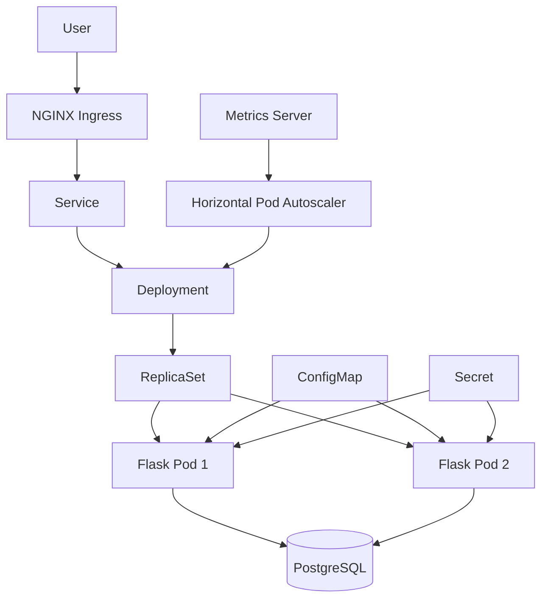

## ☸️ Kubernetes Architecture

```mermaid
flowchart TD

A[User]

A --> B[NGINX Ingress]

B --> C[Service]

C --> D[Deployment]

D --> E[ReplicaSet]

E --> F1[Flask Pod 1]
E --> F2[Flask Pod 2]

F1 --> G[(PostgreSQL)]
F2 --> G

H[ConfigMap] --> F1
H --> F2

I[Secret] --> F1
I --> F2

J[Metrics Server] --> K[Horizontal Pod Autoscaler]

K --> D
```