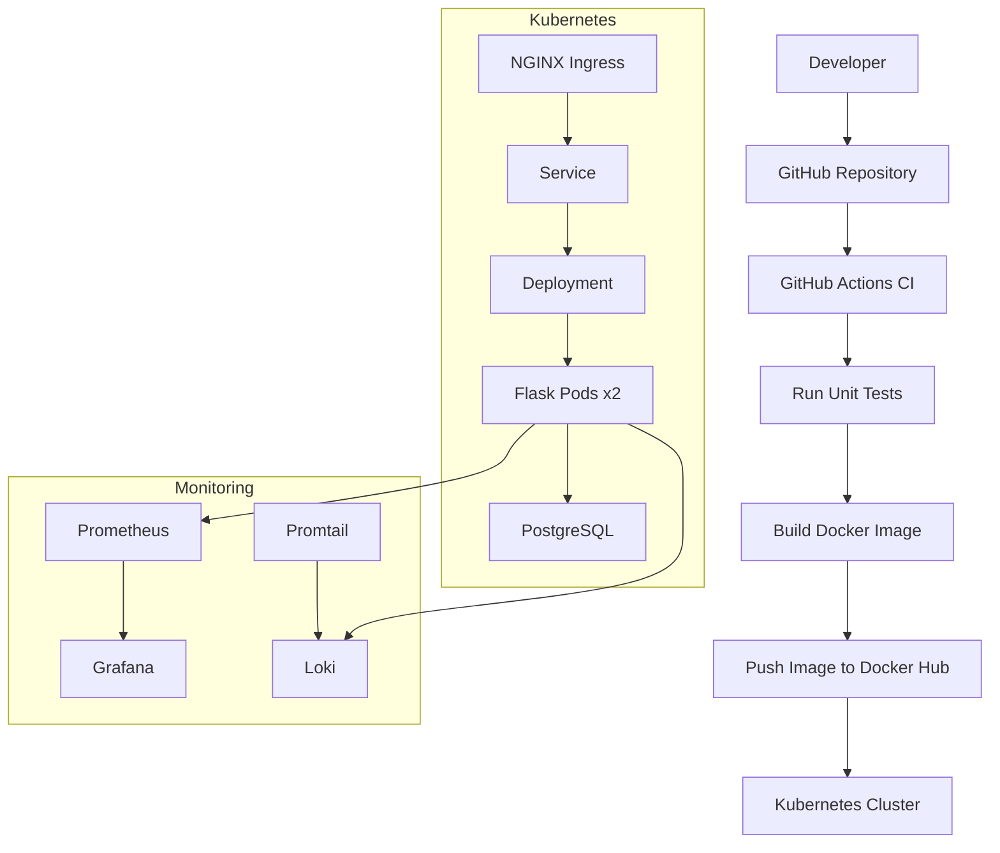

## 🏗️ Overall Architecture

```mermaid
flowchart TD

A[Developer] --> B[GitHub Repository]
B --> C[GitHub Actions CI]

C --> D[Run Unit Tests]
D --> E[Build Docker Image]
E --> F[Push Image to Docker Hub]

F --> G[Kubernetes Cluster]

subgraph Kubernetes
H[NGINX Ingress]
I[Service]
J[Deployment]
K[Flask Pods x2]
L[PostgreSQL]

H --> I
I --> J
J --> K
K --> L
end

subgraph Monitoring
M[Prometheus]
N[Grafana]
O[Loki]
P[Promtail]
end

K --> M
K --> O
P --> O
M --> N
```